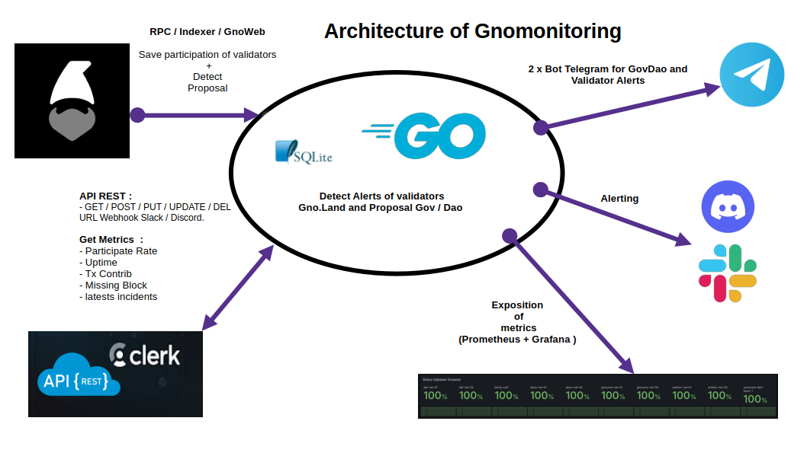
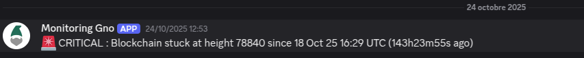
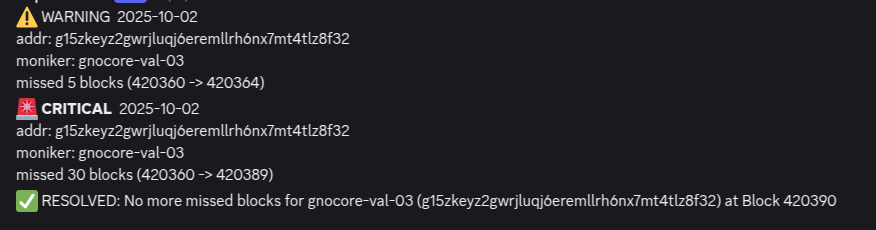

# 🛠️ Monitoring Gnoland Validators

This repository provides lightweight tools to monitor the [Gno.land](https://gno.land) blockchain and its validators.

🧩 Architecture Overview:



Two services are available:

- **GovDAO** – Detect news proposal and  status (ACCEPTED / REFUSED / IN PROGRESS).

- **Validator Alerting** – Monitors the entire validator set, calculates participation rates  and sends Discord/Slack/Telegram alerts when needed. Also exposes Prometheus metrics.

---

### 🛠️ Setup

**Requirements**

- [Docker](https://www.docker.com/)
- [Docker Compose](https://docs.docker.com/compose/)

1.Copy the configuration template and edit it:

``` bash
cd backend 
cp config.yaml.template config.yaml 
nano config.yaml
```

2.Customize parameters as needed. For example:

```yaml

backend_port: "8989"
allow_origin: "http://localhost:3000"
rpc_endpoint: "https://rpc.test9.testnets.gno.land"
metrics_port: 8888
gnoweb: "https://test9.testnets.gno.land"
graphql: "indexer.test9.testnets.gno.land/graphql/query"
clerk_secret_key: "sk_test...." #change me
dev_mode: false # Set to true for local development without Clerk auth
token_telegram_validator: ""
token_telegram_govdao: ""
```

3.Start the backend:

```bash
docker compose up -d 
```

---

<!-- ### ✅ Gno Validator Monitoring -->

#### 🔗 Webhook Management (Discord / Slack)

**✚ Add webhook URL:**

```bash
curl -L -X POST '127.0.0.7:8989/webhooks/[govdao | validator]' \
-H 'Content-Type: application/json' \
-H 'Authorization: Bearer Clerk_Token ' \
-d '{
     "URL": "https://discord.com/api/webhooks/.....",
    "Type": "discord",
    "Description":"Samourai"
  }'
```

**☰ List webhook URL:**

```bash
curl -L -X GET '127.0.0.7:8989/webhooks/[govdao | validator]' \
-H 'Content-Type: application/json' \
-H 'Authorization: Bearer Clerk_Token' 

```

**❌ Delete webhook URL:**

```bash
curl -L -X DELETE '127.0.0.7:8989/webhooks/[govdao | validator]?id=2' \
-H 'Content-Type: application/json' \
-H 'Authorization: Bearer Clerk_Token' 

```

**🔄 Update webhook URL:**

```bash
curl -L -X PUT '127.0.0.7:8989/webhooks/[govdao | validator]' \
-H 'Content-Type: application/json' \
-H 'Authorization: Bearer Clerk_Token' 
-d '{
    "ID": 3,
   
    "URL": "https://discord.com/api/...",
    "Type": "discord",
    "Description": "Samourai"
}
```

---

#### 📢 ALERTING

**Sends alerts (Discord/Slack) when:**

- Rpc is down
- The blockchain is stuck on the same block for more than 2 minutes.



- A new validator joins the network.


- A validator's missed block :
  - WARNING if a validator missed 5 blocks.
  - CRITICAL if  a validator missed more of 30 blocks
- Send Resolve Alert.



- Send Daily Report:


---

#### 📝 Expose Metrics from API REST

The disponible period for metrics:

- current_week
- current_month
- current_year
- all_time

**Participate Rate:**

The participation rate represents the percentage of blocks in which a validator successfully participated during a given time period.

```bash
curl -X GET '127.0.0.1:8989/Participation?period=all_time'
```

Response:

```json
[{"addr":"g1ek7ftha29qv4ahtv7jzpc0d57lqy7ynzklht7t","moniker":"gnocore-val-01","participationRate":100},
  {"addr":"g1j306jcl4qyhgjw78shl3ajp88vmvdcf7m7ntm2","moniker":"onbloc-val-02","participationRate":100}]
```

**Missing Block Metrics:**
The Missing Block metric measures the total number of blocks that a validator failed to participate in during a given period

```bash
curl -X GET '127.0.0.1:8989/missing_block?period=all_time''
```

Response:

```json
[{"moniker":"gnocore-val-01","addr":"g1ek7ftha29qv4ahtv7jzpc0d57lqy7ynzklht7t","missingBlock":1},
{"moniker":"onbloc-val-02","addr":"g1j306jcl4qyhgjw78shl3ajp88vmvdcf7m7ntm2","missingBlock":1},
{"moniker":"onbloc-val-01","addr":"g1kntcjkfplj0z44phajajwqkx5q4ry5yaft5q2h","missingBlock":1}...
```

**Tx Contrib Metrics:**
The Tx Contribution metric measures how much a validator has contributed to the total number of transactions processed across all validators during a specific period.

```bash
curl -X GET '127.0.0.1:8989/tx_contrib?period=all_time'
```

Response:

```json
[{"moniker":"gnocore-val-01","addr":"g1ek7ftha29qv4ahtv7jzpc0d57lqy7ynzklht7t","txContrib":14.4},
{"moniker":"onbloc-val-02","addr":"g1j306jcl4qyhgjw78shl3ajp88vmvdcf7m7ntm2","txContrib":22.9},...
```

**Lastest incidents:**
The Latest Incidents metric retrieves the most recent critical or warning events (alerts) detected for validators within a specific time period.

```bash
curl -X GET '127.0.0.1:8989/latest_incidents?period=all_time'
```

Response:

```json
[{"moniker":"onbloc-val-02","addr":"g1j306jcl4qyhgjw78shl3ajp88vmvdcf7m7ntm2","level":"CRITICAL","startHeight":78811,"endHeight":78840,"msg":"","sentAt":"2025-10-20T14:40:45.452216011-03:00"},
{"moniker":"all","addr":"all","level":"CRITICAL","startHeight":78840,"endHeight":78840,"msg":"🚨 CRITICAL : Blockchain stuck at height 78840 since 18 Oct 25 16:29 UTC (121h33m45s ago)","sentAt":"2025-10-23T15:03:10.282235678-03:00"},
{"moniker":"onbloc-val-02","addr":"g1j306jcl4qyhgjw78shl3ajp88vmvdcf7m7ntm2","level":"WARNING","startHeight":78834,"endHeight":78838,"msg":"","sentAt":"2025-10-22T13:28:53.018836743-03:00"},
```

**Uptime Metrics:**

Validator Uptime represents the percentage of the last 500 blocks in which a validator was active and participated successfully.

```bash
curl -X GET 'localhost:8989/uptime'
```

Response:

```json
[{"moniker":"onbloc-val-02","addr":"g1j306jcl4qyhgjw78shl3ajp88vmvdcf7m7ntm2","uptime":94},
{"moniker":"gnocore-val-01","addr":"g1ek7ftha29qv4ahtv7jzpc0d57lqy7ynzklht7t","uptime":100}]
```

**Operation time Metrics:**

Operation Time represents the number of days between a validator’s last successful participation and its most recent downtime.

```bash
curl -X GET 'localhost:8989/operation_time'
```

Response:

```json
[{"moniker":"gnocore-val-01",
"addr":"g1ek7ftha29qv4ahtv7jzpc0d57lqy7ynzklht7t",
"lastDownDate":"2025-10-14 08:00:00+00:00",
"lastUpDate":"2025-10-18 16:29:24.242186417+00:00","operationTime":4.4}....
```

---

#### 📈 Prometheus Metrics

Metrics are exposed at <http://localhost:8888/metrics>.


List of  metrics:

- `gnoland_validator_participation_rate{moniker="gnocore-val-01",validator_address="g1ek7ftha29qv4ahtv7jzpc0d57lqy7ynzklht7t"} 99.99873156005428`
- `gnoland_missed_blocks{moniker="gnocore-val-01",validator_address="g1ek7ftha29qv4ahtv7jzpc0d57lqy7ynzklht7t"} 1`
- `gnoland_consecutive_missed_blocks{moniker="onbloc-val-02",validator_address="g1j306jcl4qyhgjw78shl3ajp88vmvdcf7m7ntm2"} 30`

---

#### ✉️ Telegram Bot

##### 🌐 Govdao bot

**/status — list recent GovDAO proposals**
  ⮑ Params: <code>limit</code> (optional, default: 10)
 ```/status limit=5```

**/executedproposals — show the last executed proposals**
  ⮑ Params: <code>limit</code> (optional, default: 10)
 ```/executedproposals limit=5```

**/lastproposal — show the most recent proposal**

##### 🌐 Gnovalidator bot

⏱️ <b>Available periods</b>
• <code>current_week</code>
• <code>current_month</code>
• <code>current_year</code>
• <code>all_time</code>

📡 <b>Commands</b>

<code>/status [period=...] [limit=N]</code>
Shows the participation rate of validators for a given period.
Examples:
• <code>/status</code> (defaults: period=current_month, limit=10)
• <code>/status period=current_month limit=5</code>

<code>/uptime [limit=N]</code>
Displays uptime statistics of validator.
Examples:
• <code>/uptime</code> (default: limit=10)
• <code>/uptime limit=3</code>

<code>/tx_contrib [period=...] [limit=N]</code>
Shows each validator’s contribution to transaction inclusion.
Examples:
• <code>/tx_contrib</code> (defaults: period=current_month, limit=10)
• <code>/tx_contrib period=current_year limit=20</code>

<code>/missing [period=...] [limit=N]</code>
Displays how many blocks each validator missed for a given period.
Examples:
• <code>/missing</code> (defaults: period=current_month, limit=10)
• <code>/missing period=all_time limit=50</code>
