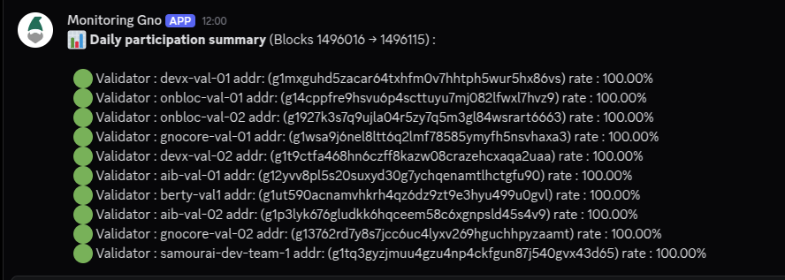
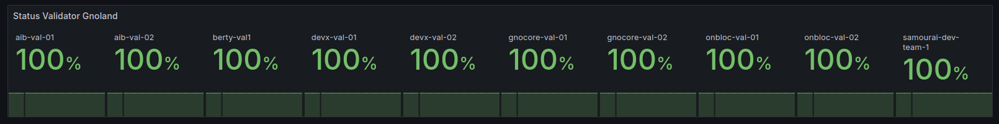

# 🛠️ Monitoring Gnoland Validators

This repository provides lightweight tools to monitor the [Gnoland](https://gno.land) blockchain and its validators.

Two services are available:

- **Block Exporter** – Tracks missed blocks from a specific Gnoland validator. It exposes [Prometheus](https://prometheus.io/) metrics, enabling [Grafana](https://grafana.com/) dashboards and alerts.

- **GovDAO & Validator Alerting** – Monitors the entire validator set, calculates participation rates over a sliding window, detects new proposals on GovDAO, and sends Discord/Slack alerts when needed. Also exposes Prometheus metrics.

---

## 🚀 Block Exporter


### Requirements

- [Docker](https://www.docker.com/)
- [Docker Compose](https://docs.docker.com/compose/)

### Setup

1. Copy the configuration template and edit it:

```bash
cd block_exporter
cp config.yaml.template config.yaml 
nano config.yaml
```

2. Configure your validator address and (optionally) the RPC endpoint:

```yaml
rpc_endpoint: "https://rpc.test8.testnets.gno.land"
validator_address: "replace with your validator address"
port: 8888
```

3. Start the container:

```bash
touch webhooks.db
docker compose up -d 
```

4. Open <http://localhost:8888/metrics> to view the following metrics:

- `gnoland_missed_blocks`
- `gnoland_consecutive_missed_blocks`

---

## 📊 GovDAO & Validator Alerting

This backend service monitors both GovDAO proposals and validator participation.

### ✅ Gno Validator Monitoring

**Sends alerts (Discord/Slack) when:**

- Rpc is down
- The blockchain is stuck on the same block for more than 2 minutes.
- A validator's participation rate drops below 100%.
- A new validator joins the network.

### 🧾 GovDAO Proposal Detection

Sends Discord alerts when a new proposal is detected on:
<https://test8.testnets.gno.land/r/gov/dao>

### 🛠️ Setup

**Requirements**

- [Docker](https://www.docker.com/)
- [Docker Compose](https://docs.docker.com/compose/)



1. Copy the configuration template and edit it:

``` bash
cd backend 
cp config.yaml.template config.yaml 
nano config.yaml
```

2. Customize parameters as needed. For example:

```yaml
interval_seconde: 1
backend_port: "8989"
allow_origin: "http://localhost:3000"
rpc_endpoint: "https://rpc.test8.testnets.gno.land"
windows_size: 100
daily_report_hour: 10 #hour of daily report
daily_report_minute: 34 # minute of daily report 
metrics_port: 8888 #port for metrics of prometheus 
```

3. Start the backend:

```bash
docker compose up -d 
```

---

### 🔗 Webhook Management (Discord / Slack)

Manage webhooks for alert delivery. Choose between validator or govdao depending on the type.

**➕ Add a webhook**

```bash
curl -X POST http://localhost:8989/webhooks/[validator / govdao]\
  -H "Content-Type: application/json" \
  -d '{"user": "username","url": "URL_WEBHOOK", "type": ["discord"/"slack"}'
```

**📋 List webhooks**

```bash
curl http://localhost:8989/webhooks/[validator / govdao]
```

**❌ Delete a webhook**

```bash
 curl -X DELETE "http://localhost:8989/webhooks/[validator / govdao]?id=x"
```

---

### 📈 Prometheus Metrics

Metrics are exposed at <http://localhost:8888/metrics>.



Example metrics:

- `gnoland_validator_participation_rate{moniker="samourai-dev-team-1",validator_address="g1tq3gyzjmuu4gzu4np4ckfgun87j540gvx43d65"} 100`
- `gnoland_block_window_start_height 100`
- `gnoland_block_window_end_height 199`
