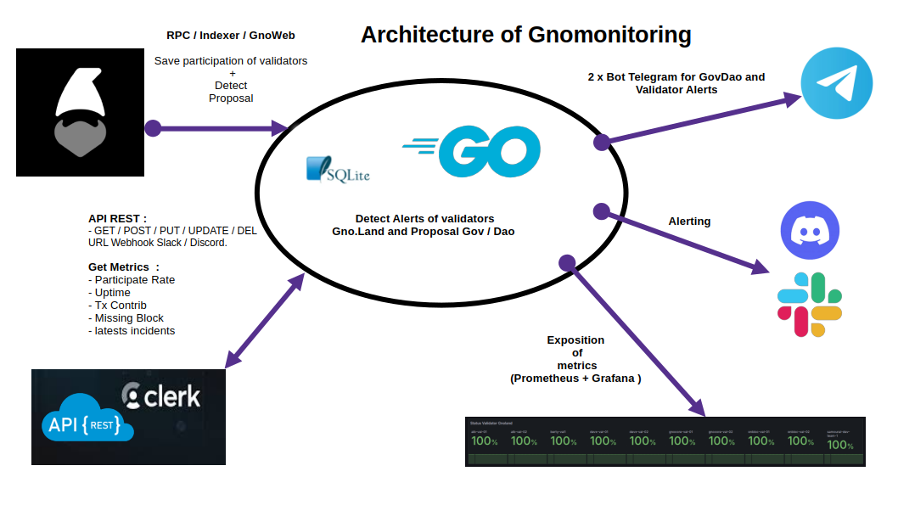
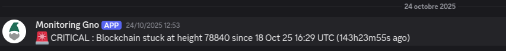
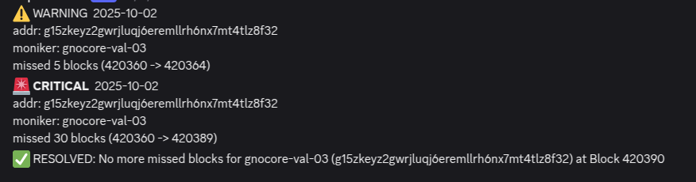
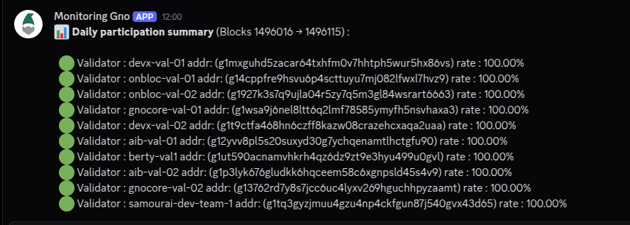

# 🛠️ Monitoring Gnoland Validators

This repository provides lightweight tools to monitor the [Gno.land](https://gno.land) blockchain and its validators.

🧩 Architecture Overview:



Two services are available:

- **GovDAO** – Detect news proposal and  status (ACCEPTED / REFUSED / IN PROGRESS).

- **Validator Alerting** – Monitors the entire validator set, calculates participation rates  and sends Discord/Slack/Telegram alerts when needed. Also exposes Prometheus metrics.

---

## 🛠️ Setup

### Requirements

- [Docker](https://www.docker.com/)
- [Docker Compose](https://docs.docker.com/compose/)

1.Copy the configuration template and edit it:

``` bash
cd backend 
cp config.yaml.template config.yaml 
nano config.yaml
```

2.Customize parameters as needed. For example:

```yaml

backend_port: "8989"
allow_origin: "http://localhost:3000"
rpc_endpoint: "https://rpc.test9.testnets.gno.land"
metrics_port: 8888
gnoweb: "https://test9.testnets.gno.land"
graphql: "indexer.test9.testnets.gno.land/graphql/query"
clerk_secret_key: "sk_test...." #change me
dev_mode: false # Set to true for local development without Clerk auth
token_telegram_validator: ""
token_telegram_govdao: ""
```

3.Start the backend:

```bash
docker compose up -d 
```

---

## 🌍 Multi-Chain Support

Gnomonitoring now supports monitoring multiple Gno.land blockchains simultaneously from a single deployment. Each chain runs independently while sharing the same database and REST API.

### Overview

Instead of deploying separate instances per chain, you can configure multiple chains in one `config.yaml`. Each chain:

- Has its own RPC endpoint, GraphQL indexer, and Gnoweb UI
- Maintains independent validator monitoring loops
- Stores data isolated by chain ID in SQLite
- Sends alerts and reports scoped to its validators
- Works seamlessly with webhooks, Telegram bots, and Prometheus metrics

### Configuration

Edit `config.yaml` to define your chains:

```yaml
backend_port: "8989"
metrics_port: 8888
dev_mode: true
clerk_secret_key: "sk_test...."
token_telegram_validator: ""
token_telegram_govdao: ""

# Default chain used when no ?chain= query parameter is supplied
default_chain: "test12"

# Multi-chain configuration
chains:
  test12:
    rpc_endpoint: "https://rpc.test12.testnets.gno.land"
    graphql: "https://indexer.test12.testnets.gno.land/graphql/query"
    gnoweb: "https://test12.testnets.gno.land"
    enabled: true

  gnoland1:
    rpc_endpoint: "https://rpc.betanet.testnets.gno.land"
    graphql: "https://indexer.betanet.testnets.gno.land/graphql/query"
    gnoweb: "https://betanet.testnets.gno.land"
    enabled: true

  test11:
    rpc_endpoint: "https://rpc.test11.testnets.gno.land"
    graphql: "https://indexer.test11.testnets.gno.land/graphql/query"
    gnoweb: "https://test11.testnets.gno.land"
    enabled: false  # Disable by setting to false
```

**Key points:**

- Each chain gets a unique identifier (e.g., `test12`, `gnoland1`)
- Set `enabled: true` to monitor a chain
- Set `enabled: false` to disable a chain without removing it
- `default_chain` is used when clients don't specify a chain parameter
- All disabled chains are ignored during startup

### API Endpoints with Chain Parameter

Most API endpoints accept an optional `?chain=<chain_id>` query parameter to scope results to a specific chain. If omitted, the default chain is used.

**Examples:**

```bash
# Get participation rate for default chain (test12)
curl 'http://localhost:8989/Participation?period=current_month'

# Get participation rate for specific chain
curl 'http://localhost:8989/Participation?chain=gnoland1&period=current_month'

# Get uptime for test12 chain
curl 'http://localhost:8989/uptime?chain=test12'

# Get block height for gnoland1 chain
curl 'http://localhost:8989/block_height?chain=gnoland1'

# Get missing blocks for test11 chain
curl 'http://localhost:8989/missing_block?chain=test11'
```

### Webhook Management with Chain Scoping

Webhooks can be created for a specific chain or globally to receive alerts from all chains.

**Create a webhook for a specific chain:**

```bash
curl -L -X POST 'http://localhost:8989/webhooks/validator?chain=gnoland1' \
  -H 'Content-Type: application/json' \
  -H 'Authorization: Bearer <Clerk_Token>' \
  -d '{
    "URL": "https://discord.com/api/webhooks/...",
    "Type": "discord",
    "Description": "GnoLand1 Alerts"
  }'
```

**Create a global webhook (all chains):**

```bash
curl -L -X POST 'http://localhost:8989/webhooks/validator' \
  -H 'Content-Type: application/json' \
  -H 'Authorization: Bearer <Clerk_Token>' \
  -d '{
    "URL": "https://discord.com/api/webhooks/...",
    "Type": "discord",
    "Description": "All Chains Alerts"
  }'
```

**Alert messages include chain labels:**

When an alert is sent, it includes the chain identifier:

```text
[test12] WARNING: Validator gnocore-val-01 missed 5 blocks (#12345-#12349)
[gnoland1] CRITICAL: Validator onbloc-val-02 missed 30 blocks (#67890-#67919)
```

### Telegram Bot Multi-Chain Support

The Telegram validator bot includes commands to switch between chains on a per-chat basis.

**New commands:**

- `/chain` - Display current active chain and list all enabled chains

```text
Current chain: test12

Available chains:
- test12
- gnoland1
- test11

Use /setchain <chain> to switch chains.
```

- `/setchain <chain_id>` - Switch the active chain for this chat

```text
/setchain gnoland1
→ Active chain set to gnoland1

/setchain
→ Using default chain: test12
```

**Updated commands (all work per-chain context):**

- `/status` - Get validator participation rate on active chain
- `/uptime` - Get validator uptime on active chain
- `/tx_contrib` - Get validator transaction contribution on active chain
- `/missing` - List validators with missed blocks on active chain
- `/subscribe on <address>` - Subscribe to validator alerts on active chain
- `/subscribe off <address>` - Unsubscribe from validator alerts on active chain
- `/subscribe list` - Show your subscriptions on active chain

**Hourly reports per chain:**

When you activate `/report`, you receive daily reports for your currently active chain. Switch chains with `/setchain` and activate reports on each chain independently.

### Prometheus Metrics with Chain Labels

All Prometheus metrics include a `chain` label to distinguish data by chain:

```text
gnoland_missed_blocks{chain="test12",moniker="gnocore-val-01",validator_address="g1ek7ftha29qv4ahtv7jzpc0d57lqy7ynzklht7t"} 5
gnoland_missed_blocks{chain="gnoland1",moniker="onbloc-val-02",validator_address="g1j306jcl4qyhgjw78shl3ajp88vmvdcf7m7ntm2"} 12

gnoland_validator_participation_rate{chain="test12",moniker="gnocore-val-01",validator_address="g1ek7ftha29qv4ahtv7jzpc0d57lqy7ynzklht7t"} 99.98
gnoland_validator_participation_rate{chain="gnoland1",moniker="onbloc-val-02",validator_address="g1j306jcl4qyhgjw78shl3ajp88vmvdcf7m7ntm2"} 98.5
```

Use Prometheus relabeling or Grafana to group metrics by chain:

```yaml
metric_relabel_configs:
  - source_labels: [chain]
    regex: (.+)
    action: keep
```

### Known Limitations

1. **GovDAO Bot Single-Chain**: The GovDAO bot monitors proposals only on the `default_chain`. To monitor proposals on multiple chains, deploy separate instances.

2. **Prometheus Memory**: Each (chain × validator × metric) creates a new time series. With 5 chains and 100 validators, expect ~1500 metric series. Monitor Prometheus memory usage; archive old data if needed.

3. **SQLite Scaling**: Suitable for up to 1M records per chain per year. With 5 chains at 200K records/year each, SQLite handles 1M total records. Beyond 5M records, implement data archiving or migrate to PostgreSQL.

---

#### 🔗 Webhook Management (Discord / Slack)

**✚ Add webhook URL:**

```bash
curl -L -X POST '127.0.0.7:8989/webhooks/[govdao | validator]' \
-H 'Content-Type: application/json' \
-H 'Authorization: Bearer Clerk_Token ' \
-d '{
     "URL": "https://discord.com/api/webhooks/.....",
    "Type": "discord",
    "Description":"Samourai"
  }'
```

**☰ List webhook URL:**

```bash
curl -L -X GET '127.0.0.7:8989/webhooks/[govdao | validator]' \
-H 'Content-Type: application/json' \
-H 'Authorization: Bearer Clerk_Token' 

```

**❌ Delete webhook URL:**

```bash
curl -L -X DELETE '127.0.0.7:8989/webhooks/[govdao | validator]?id=2' \
-H 'Content-Type: application/json' \
-H 'Authorization: Bearer Clerk_Token' 

```

**🔄 Update webhook URL:**

```bash
curl -L -X PUT '127.0.0.7:8989/webhooks/[govdao | validator]' \
-H 'Content-Type: application/json' \
-H 'Authorization: Bearer Clerk_Token' 
-d '{
    "ID": 3,
   
    "URL": "https://discord.com/api/...",
    "Type": "discord",
    "Description": "Samourai"
}
```

---

#### 📢 ALERTING

**Sends alerts (Discord/Slack) when:**

- Rpc is down
- The blockchain is stuck on the same block for more than 2 minutes.



- A new validator joins the network.


- A validator's missed block :
  - WARNING if a validator missed 5 blocks.
  - CRITICAL if  a validator missed more of 30 blocks
- Send Resolve Alert.



- Send Daily Report:



---

#### 📝 Expose Metrics from API REST

The disponible period for metrics:

- current_week
- current_month
- current_year
- all_time

**Participate Rate:**

The participation rate represents the percentage of blocks in which a validator successfully participated during a given time period.

```bash
curl -X GET '127.0.0.1:8989/Participation?period=all_time'
```

Response:

```json
[{"addr":"g1ek7ftha29qv4ahtv7jzpc0d57lqy7ynzklht7t","moniker":"gnocore-val-01","participationRate":100},
  {"addr":"g1j306jcl4qyhgjw78shl3ajp88vmvdcf7m7ntm2","moniker":"onbloc-val-02","participationRate":100}]
```

**Missing Block Metrics:**
The Missing Block metric measures the total number of blocks that a validator failed to participate in during a given period

```bash
curl -X GET '127.0.0.1:8989/missing_block?period=all_time''
```

Response:

```json
[{"moniker":"gnocore-val-01","addr":"g1ek7ftha29qv4ahtv7jzpc0d57lqy7ynzklht7t","missingBlock":1},
{"moniker":"onbloc-val-02","addr":"g1j306jcl4qyhgjw78shl3ajp88vmvdcf7m7ntm2","missingBlock":1},
{"moniker":"onbloc-val-01","addr":"g1kntcjkfplj0z44phajajwqkx5q4ry5yaft5q2h","missingBlock":1}...
```

**Tx Contrib Metrics:**
The Tx Contribution metric measures how much a validator has contributed to the total number of transactions processed across all validators during a specific period.

```bash
curl -X GET '127.0.0.1:8989/tx_contrib?period=all_time'
```

Response:

```json
[{"moniker":"gnocore-val-01","addr":"g1ek7ftha29qv4ahtv7jzpc0d57lqy7ynzklht7t","txContrib":14.4},
{"moniker":"onbloc-val-02","addr":"g1j306jcl4qyhgjw78shl3ajp88vmvdcf7m7ntm2","txContrib":22.9},...
```

**Lastest incidents:**
The Latest Incidents metric retrieves the most recent critical or warning events (alerts) detected for validators within a specific time period.

```bash
curl -X GET '127.0.0.1:8989/latest_incidents?period=all_time'
```

Response:

```json
[{"moniker":"onbloc-val-02","addr":"g1j306jcl4qyhgjw78shl3ajp88vmvdcf7m7ntm2","level":"CRITICAL","startHeight":78811,"endHeight":78840,"msg":"","sentAt":"2025-10-20T14:40:45.452216011-03:00"},
{"moniker":"all","addr":"all","level":"CRITICAL","startHeight":78840,"endHeight":78840,"msg":"🚨 CRITICAL : Blockchain stuck at height 78840 since 18 Oct 25 16:29 UTC (121h33m45s ago)","sentAt":"2025-10-23T15:03:10.282235678-03:00"},
{"moniker":"onbloc-val-02","addr":"g1j306jcl4qyhgjw78shl3ajp88vmvdcf7m7ntm2","level":"WARNING","startHeight":78834,"endHeight":78838,"msg":"","sentAt":"2025-10-22T13:28:53.018836743-03:00"},
```

**Uptime Metrics:**

Validator Uptime represents the percentage of the last 500 blocks in which a validator was active and participated successfully.

```bash
curl -X GET 'localhost:8989/uptime'
```

Response:

```json
[{"moniker":"onbloc-val-02","addr":"g1j306jcl4qyhgjw78shl3ajp88vmvdcf7m7ntm2","uptime":94},
{"moniker":"gnocore-val-01","addr":"g1ek7ftha29qv4ahtv7jzpc0d57lqy7ynzklht7t","uptime":100}]
```

**Operation time Metrics:**

Operation Time represents the number of days between a validator’s last successful participation and its most recent downtime.

```bash
curl -X GET ‘localhost:8989/operation_time’
```

Response:

```json
[{"moniker":"gnocore-val-01",
"addr":"g1ek7ftha29qv4ahtv7jzpc0d57lqy7ynzklht7t",
"lastDownDate":"2025-10-14 08:00:00+00:00",
"lastUpDate":"2025-10-18 16:29:24.242186417+00:00","operationTime":4.4}....
```

**First Seen Metrics:**

Returns the first block date at which each validator was observed participating.

```bash
curl -X GET ‘localhost:8989/first_seen’
```

Response:

```json
[{"addr":"g1ek7ftha29qv4ahtv7jzpc0d57lqy7ynzklht7t","moniker":"gnocore-val-01","firstSeen":"2025-09-01 12:00:00+00:00"},
{"addr":"g1j306jcl4qyhgjw78shl3ajp88vmvdcf7m7ntm2","moniker":"onbloc-val-02","firstSeen":"2025-09-02 08:30:00+00:00"}]
```

**Block Height:**

Returns the last block height stored in the database.

```bash
curl -X GET ‘localhost:8989/block_height’
```

Response:

```json
{"last_stored": 123456}
```

**Info:**

Returns the configured Gnoweb and RPC endpoint URLs.

```bash
curl -X GET ‘localhost:8989/info’
```

Response:

```json
{"gnoweb":"https://test9.testnets.gno.land","rpc":"https://rpc.test9.testnets.gno.land"}
```

**Addr Moniker:**

Returns the moniker for a given validator address.

```bash
curl -X GET ‘localhost:8989/addr_moniker?addr=g1ek7ftha29qv4ahtv7jzpc0d57lqy7ynzklht7t’
```

Response:

```json
{"addr":"g1ek7ftha29qv4ahtv7jzpc0d57lqy7ynzklht7t","moniker":"gnocore-val-01"}
```

---

#### 👤 User Management (protected)

All endpoints below require a valid Clerk `Authorization: Bearer <token>` header (or `X-Debug-UserID` in dev mode).

**Create user:**

```bash
curl -X POST ‘localhost:8989/users’ \
  -H ‘Authorization: Bearer <token>’ \
  -H ‘Content-Type: application/json’ \
  -d ‘{"name":"Alice","email":"alice@example.com"}’
```

**Get user:**

```bash
curl -X GET ‘localhost:8989/users?user_id=<user_id>’ \
  -H ‘Authorization: Bearer <token>’
```

**Update user:**

```bash
curl -X PUT ‘localhost:8989/users’ \
  -H ‘Authorization: Bearer <token>’ \
  -H ‘Content-Type: application/json’ \
  -d ‘{"name":"Alice Updated","email":"alice2@example.com"}’
```

**Delete user:**

```bash
curl -X DELETE ‘localhost:8989/users’ \
  -H ‘Authorization: Bearer <token>’
```

---

#### 🔔 Alert Contacts (protected)

Manage contacts that receive mention tags in CRITICAL alerts.

**List contacts:**

```bash
curl -X GET ‘localhost:8989/alert-contacts’ \
  -H ‘Authorization: Bearer <token>’
```

**Add contact:**

```bash
curl -X POST ‘localhost:8989/alert-contacts’ \
  -H ‘Authorization: Bearer <token>’ \
  -H ‘Content-Type: application/json’ \
  -d ‘{"moniker":"gnocore-val-01","namecontact":"Bob","mention_tag":"123456789","id_webhook":1}’
```

**Update contact:**

```bash
curl -X PUT ‘localhost:8989/alert-contacts’ \
  -H ‘Authorization: Bearer <token>’ \
  -H ‘Content-Type: application/json’ \
  -d ‘{"id":1,"moniker":"gnocore-val-01","namecontact":"Bob","mention_tag":"987654321","id_webhook":1}’
```

**Delete contact:**

```bash
curl -X DELETE ‘localhost:8989/alert-contacts?id=1’ \
  -H ‘Authorization: Bearer <token>’
```

---

#### 🕘 Daily Report Schedule (protected)

Configure the hour at which the daily report is sent.

**Get current schedule:**

```bash
curl -X GET ‘localhost:8989/usersH’ \
  -H ‘Authorization: Bearer <token>’
```

Response:

```json
{"user_id":"...","daily_report_hour":9,"daily_report_minute":0,"timezone":"Europe/Paris"}
```

**Update schedule:**

```bash
curl -X PUT ‘localhost:8989/usersH’ \
  -H ‘Authorization: Bearer <token>’ \
  -H ‘Content-Type: application/json’ \
  -d ‘{"hour":8,"minute":30,"timezone":"America/New_York"}’
```

---

### 📈 Prometheus Metrics

Metrics are exposed at <http://localhost:8888/metrics>. All metrics include chain labels to support multi-chain deployments.

**Validator Metrics** (per-validator, updated every 5 minutes):

- `gnoland_validator_uptime` — Participation rate (%) over last 500 blocks
- `gnoland_validator_operation_time` — Days since validator's last downtime event
- `gnoland_validator_tx_contribution` — Transaction contribution (%) in current month
- `gnoland_validator_missing_blocks_month` — Blocks missed in current month
- `gnoland_validator_first_seen_unix` — Unix timestamp of first participation

**Chain Metrics** (chain-level aggregates):

- `gnoland_chain_active_validators` — Number of active validators (last 100 blocks)
- `gnoland_chain_avg_participation_rate` — Average participation rate (%) across chain
- `gnoland_chain_current_height` — Current blockchain height

**Alert Metrics** (active and cumulative alerts):

- `gnoland_active_alerts` — Currently unresolved alerts by severity (CRITICAL/WARNING)
- `gnoland_alerts_total` — Cumulative alert count by severity

**Label examples:**

```prometheus
gnoland_validator_uptime{chain="test12",validator_address="g1ek7ftha29qv4ahtv7jzpc0d57lqy7ynzklht7t",moniker="gnocore-val-01"} 99.5
gnoland_chain_active_validators{chain="test12"} 125
gnoland_active_alerts{chain="test12",level="CRITICAL"} 2
```

**PromQL query examples:**

```promql
# Uptime for all validators on test12 chain
gnoland_validator_uptime{chain="test12"}

# Validators with uptime below 95%
gnoland_validator_uptime{chain="test12"} < 95

# Total active alerts across all chains
sum(gnoland_active_alerts)

# Average participation rate by chain
avg by (chain) (gnoland_chain_avg_participation_rate)
```

**Performance notes:**

Metrics are computed every 5 minutes with a 2-minute timeout per chain to prevent slowdowns on heavily-loaded networks. Validator metrics use a 30-day rolling window (not full history) to maintain query performance.

---

### ✉️ Telegram Bot

#### 🌐 Govdao bot

**/status — list recent GovDAO proposals**
  ⮑ Params: `limit` (optional, default: 10)

```bash
/status limit=5
```

#### /executedproposals — show the last executed proposals

⮑ Params: `limit` (optional, default: 10)

```/executedproposals limit=5```

#### /lastproposal — show the most recent proposal

##### 🌐 Gnovalidator bot

⏱️ **Available periods**

- ```current_week```
- ```current_month```
- ```current_year```
- ```all_time```

📡 **Commands**

🚦 **Particpate rate command**
Shows the participation rate of validators for a given period.
Examples:

```/status [period=...] [limit=N]```

- ```/status``` (defaults: period=current_month, limit=10)
- ```/status period=current_month limit=5```

🕒 **Up time command**
Displays uptime statistics of validator.
Examples:

```/uptime [limit=N]```

- ```/uptime``` (default: limit=10)
- ```/uptime limit=3```

💪 **Tx contribution command**
Shows each validator’s contribution to transaction inclusion.
Examples:
```/tx_contrib [period=...] [limit=N]```

- ```/tx_contrib``` (defaults: period=current_month, limit=10)
- ```/tx_contrib period=current_year limit=20```

🚧 **Subscribe missing block command**
Displays how many blocks each validator missed for a given period.
Examples:

```/missing [period=...] [limit=N]```

- ```/missing``` (defaults: period=current_month, limit=10)
- ```/missing period=all_time limit=50```

📬 **Subscribe command**
 Show your active subscriptions and available validators

- ```/subscribe list```

 Enable alerts for one or more validators

- ```/subscribe on [addr] [more...]```

 Disable alerts for one or more validators

- ```/subscribe off [addr] [more...]```\n

 Enable alerts for all validators

- ```/subscribe on all```

 Disable alerts for all validators

- ```/subscribe off all```
